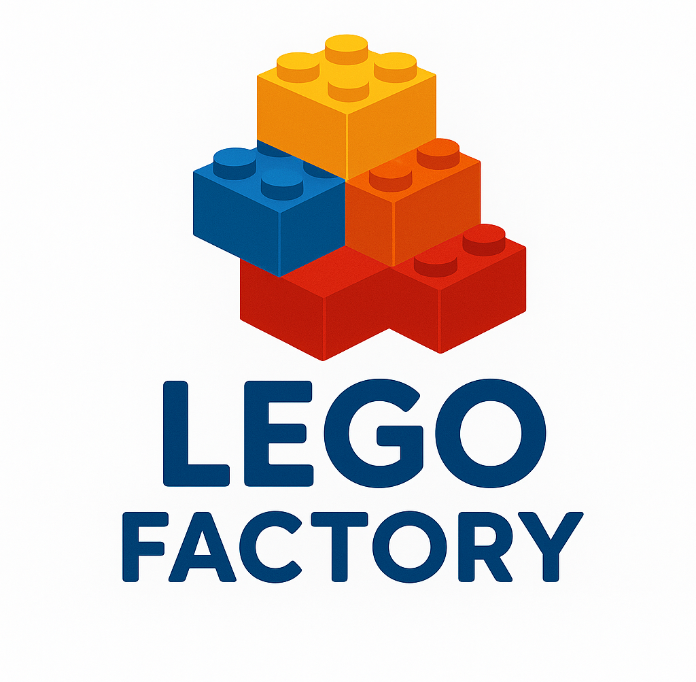
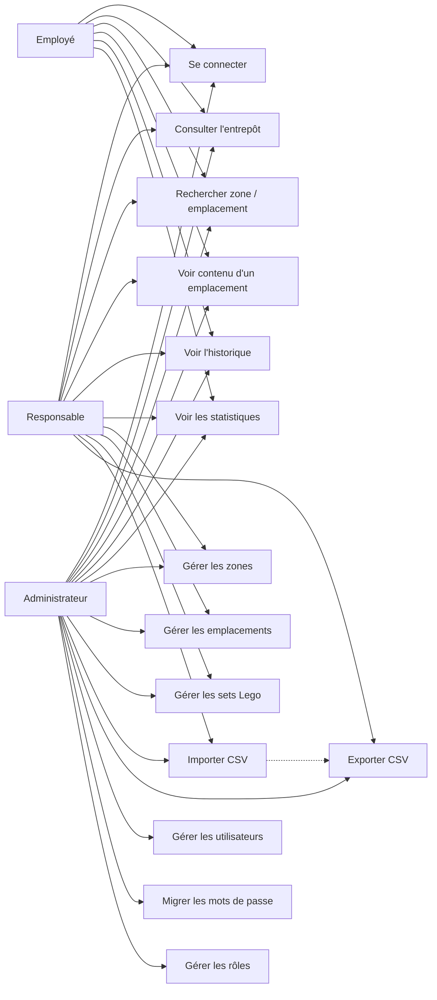

# 🧱 LegoFactory - Application de gestion d'entrepôt Lego

<p align="center">
  
</p>

Application de bureau Windows permettant de gérer un entrepôt de sets Lego : zones de stockage, emplacements, inventaire des sets, suivi des opérations et gestion des utilisateurs avec contrôle d'accès par rôles.

## ✨ Fonctionnalités

### Gestion de l'entrepôt
- Vue arborescente de la structure complète de l'entrepôt (Zones → Emplacements → Sets)
- Barre de recherche pour filtrer les zones et emplacements
- Statistiques en temps réel (nombre de zones, emplacements, sets stockés)
- Consultation du contenu de chaque emplacement

### Gestion des zones
- Création, modification et suppression de zones de stockage
- Vérification des doublons de noms
- Compteur d'emplacements par zone

### Gestion des emplacements
- Création avec code auto-généré (Zone + Étage + Rangée, ex: A0101)
- Modification de la capacité maximale
- Suivi des dates d'entrée et de sortie
- Compteur de sets stockés par emplacement

### Gestion des sets Lego
- CRUD complet (ajout, modification, suppression)
- Recherche par référence ou nom
- Association d'un set à un emplacement avec gestion des quantités
- Informations : référence, nom, âge cible, nombre de pièces, quantité

### Import / Export
- Import de sets depuis un fichier CSV (format : `Reference;nom;AgeCible;NombresPieces;quantite`)
- Export des données au format CSV
- Téléchargement d'un template CSV vierge

### Historique et audit
- Journalisation automatique de toutes les actions utilisateurs
- Filtrage par période (date début / date fin)
- Recherche par mot-clé
- Traçabilité complète : qui a fait quoi et quand

### Statistiques
- Nombre total de sets, emplacements et emplacements vides
- Répartition des sets par zone (nombre de sets différents et quantité totale)

### Gestion des utilisateurs et rôles
- Création, modification et suppression de comptes utilisateurs
- 3 niveaux de rôles avec permissions différentes :
  - **Employé** : consultation uniquement (entrepôt, historique, statistiques)
  - **Responsable** : consultation + gestion du stock (zones, emplacements, sets, import/export)
  - **Admin** : accès complet + gestion des utilisateurs et migration des mots de passe

### Sécurité
- Hachage des mots de passe avec BCrypt (workFactor 12)
- Migration automatique des mots de passe en clair vers BCrypt
- Requêtes SQL paramétrées (protection injection SQL)
- Variables d'environnement pour les secrets (fichier `.env` non versionné)
- Contrôle d'accès basé sur les rôles (RBAC) à chaque action
- Messages d'erreur génériques (pas de fuite d'information)

## 📋 Prérequis

Avant de commencer, installez ces logiciels sur votre ordinateur :

### 1️⃣ .NET 8.0 SDK

- Téléchargez depuis [dotnet.microsoft.com](https://dotnet.microsoft.com/en-us/download/dotnet/8.0)
- Choisissez le **SDK** (pas le Runtime seul)
- Installez l'exécutable

**Vérification :** Ouvrez un terminal et tapez :
```bash
dotnet --version
```
Vous devez voir : `8.0.x` ou supérieur

### 2️⃣ MySQL

**Option facile - XAMPP (recommandé pour débutants) :**
- Téléchargez [XAMPP](https://www.apachefriends.org/fr/download.html)
- Installez uniquement MySQL
- Démarrez MySQL depuis le panneau XAMPP

**Ou MySQL seul :**
- Téléchargez [MySQL Community Server](https://dev.mysql.com/downloads/mysql/)
- Lors de l'installation, notez le mot de passe root

**Vérification :** Ouvrez XAMPP et vérifiez que MySQL est démarré (vert)

### 3️⃣ Git

- Téléchargez depuis [git-scm.com](https://git-scm.com/downloads)
- Installez avec les options par défaut

**Vérification :**
```bash
git --version
```

## 🚀 Installation - Étape par étape

### Étape 1 : Télécharger le projet

Ouvrez un terminal (PowerShell ou CMD) et tapez :

```bash
git clone https://github.com/Losange2/Entrepot-lego.git
cd Entrepot-lego
```

### Étape 2 : Configurer la base de données

Créez un fichier `.env` dans le dossier `LegoFactory/` en vous basant sur le template :

**Windows (PowerShell) :**
```bash
copy LegoFactory\.env.example LegoFactory\.env
notepad LegoFactory\.env
```

Modifiez les valeurs avec vos identifiants MySQL :

```env
DB_SERVER=localhost
DB_NAME=LegoFactory
DB_USER=root
DB_PASSWORD=votre_mot_de_passe
```

**💾 Enregistrez** et fermez le fichier.

### Étape 3 : Créer la base de données

Connectez-vous à MySQL (via phpMyAdmin ou en ligne de commande) et exécutez :

```sql
CREATE DATABASE IF NOT EXISTS LegoFactory;
```

Puis importez le schéma de la base de données (tables Utilisateur, Zone, Emplacement, LegoSet, stocker, Historique).

### Étape 4 : Installer les dépendances et compiler

```bash
cd LegoFactory
dotnet restore
dotnet build
```

### Étape 5 : Lancer l'application

```bash
dotnet run --project LegoFactory
```

✅ **C'est prêt !** La fenêtre de connexion LegoFactory s'ouvre.

## 👥 Comptes par défaut

### 👨‍💼 Compte Administrateur

```
Login : admin
Mot de passe : admin
Rôle : Admin
```

**Permissions :**
- Accès complet à toutes les fonctionnalités
- Gestion des utilisateurs et des rôles
- Migration des mots de passe legacy

### 👷 Compte Responsable

```
Login : responsable
Mot de passe : responsable
Rôle : Responsable
```

**Permissions :**
- Gestion du stock (zones, emplacements, sets)
- Import/Export CSV
- Consultation historique et statistiques

### 👨‍🏭 Compte Employé

```
Login : employe
Mot de passe : employe
Rôle : Employe
```

**Permissions :**
- Consultation de l'entrepôt (lecture seule)
- Consultation de l'historique
- Consultation des statistiques

> ⚠️ Les mots de passe en clair seront automatiquement migrés vers BCrypt lors de la première connexion.

## 📁 Structure du projet

```
Entrepot-lego/
├── README.md
├── shemaUML LegoFactory.png
├── LegoFactory/
│   ├── .env                     # Variables d'environnement (non versionné)
│   ├── .env.example             # Template de configuration
│   └── LegoFactory/
│       ├── Program.cs           # Point d'entrée de l'application
│       ├── LoginForm.cs         # Formulaire de connexion
│       ├── LoginForm.Designer.cs
│       ├── DatabaseConnection.cs # Connexion MySQL
│       ├── LegoFactory.csproj   # Configuration du projet .NET
│       ├── DashboardAdmin.cs    # Tableau de bord administrateur
│       ├── DashboardResponsable.cs # Tableau de bord responsable
│       ├── DashboardEmploye.cs  # Tableau de bord employé
│       ├── img/
│       │   └── logo.png         # Logo de l'application
│       ├── Models/
│       │   ├── CurrentUser.cs   # Singleton session utilisateur + enum rôles
│       │   └── HistoriqueHelper.cs # Service de journalisation
│       ├── Security/
│       │   └── PasswordHasher.cs # Utilitaire de hachage BCrypt
│       ├── Utils/
│       │   └── PasswordMigrationTool.cs # Outil de migration des mots de passe
│       └── Views/
│           ├── DashboardWelcome.cs    # Page d'accueil avec statistiques
│           ├── EntrepotView.cs        # Vue arborescente de l'entrepôt
│           ├── ZonesView.cs           # Gestion des zones
│           ├── EmplacementsView.cs    # Gestion des emplacements
│           ├── SetsView.cs            # Gestion des sets Lego
│           ├── HistoriqueView.cs      # Consultation de l'historique
│           ├── ImportExportView.cs    # Import/Export CSV
│           ├── StatsView.cs           # Statistiques et rapports
│           ├── UsersRolesView.cs      # Gestion des utilisateurs
│           ├── SyncView.cs            # Synchronisation externe (placeholder)
│           ├── AddSetForm.cs          # Dialogue ajout de set
│           ├── EditSetForm.cs         # Dialogue modification de set
│           ├── AddEmplacementForm.cs  # Dialogue ajout d'emplacement
│           ├── EditCapaciteForm.cs    # Dialogue modification de capacité
│           ├── AddUserForm.cs         # Dialogue ajout d'utilisateur
│           └── EditUserForm.cs        # Dialogue modification d'utilisateur
```

## 🎯 Utilisation

### Pour un employé

1. **Se connecter** avec ses identifiants
2. **Consulter l'entrepôt** : Explorer la structure (zones → emplacements → sets) via l'arborescence
3. **Rechercher** : Filtrer les zones et emplacements avec la barre de recherche
4. **Voir l'historique** : Consulter les opérations effectuées avec filtres par date
5. **Consulter les statistiques** : Voir les chiffres clés de l'entrepôt

### Pour un responsable

Tout ce qu'un employé peut faire, plus :
1. **Gérer les zones** : Ajouter, renommer ou supprimer des zones
2. **Gérer les emplacements** : Créer des emplacements, modifier leur capacité
3. **Gérer les sets** : Ajouter, modifier ou supprimer des sets Lego
4. **Import/Export** : Importer des sets depuis un CSV ou exporter les données

### Pour un administrateur

Tout ce qu'un responsable peut faire, plus :
1. **Gérer les utilisateurs** : Créer des comptes, modifier les rôles, supprimer des comptes
2. **Migrer les mots de passe** : Convertir les mots de passe legacy vers BCrypt

## 🗄️ Schéma de base de données

La base de données MySQL comporte **7 tables** :

| Table | Description |
|-------|-------------|
| **Utilisateur** | Comptes utilisateurs (nom, login, mot de passe BCrypt, rôle) |
| **Entrepot** | Entrepôt principal (conteneur racine) |
| **Zone** | Zones de stockage rattachées à l'entrepôt |
| **Emplacement** | Emplacements physiques dans chaque zone (code, capacité, dates) |
| **LegoSet** | Sets Lego (référence, nom, âge cible, nombre de pièces, quantité) |
| **stocker** | Table d'association : quel set est stocké dans quel emplacement (quantité) |
| **Historique** | Journal d'audit de toutes les actions avec horodatage |

**Relations :**
- `Entrepot` 1 → * `Zone` → * `Emplacement`
- `Emplacement` * ↔ * `LegoSet` (via `stocker`)
- `Utilisateur` 1 → * `Historique`

### Diagramme de classes UML


## � Cas d'utilisation (Use Case)

Le diagramme de cas d'utilisation ci-dessous décrit les principaux rôles et actions de l'application.



> Si votre lecteur Markdown supporte Mermaid, ce bloc génèrera automatiquement le diagramme. Sinon, utilisez mermaid.live et copiez-y le même code.

## �🌐 Technologies utilisées

### Application
- **C#** - Langage de programmation principal
- **Windows Forms (.NET 8.0)** - Framework d'interface graphique
- **GDI+** - Rendu graphique personnalisé (TreeView, cartes, icônes)

### Base de données
- **MySQL** - Système de gestion de base de données
- **MySql.Data 9.5.0** - Connecteur ADO.NET pour MySQL
- 7 tables avec relations (1-N, N-N via table d'association)

### Sécurité
- **BCrypt.Net-Next 4.1.0** - Hachage sécurisé des mots de passe (workFactor 12)
- **DotNetEnv 3.1.1** - Gestion des variables d'environnement
- Requêtes SQL paramétrées (anti injection SQL)
- Contrôle d'accès RBAC (Role-Based Access Control)

### Outils
- **Visual Studio 2022** / **Visual Studio Code** - Environnements de développement
- **Git** - Contrôle de version
- **GitHub** - Hébergement du code source
- **Microsoft Teams** - Communication d'équipe

## 📝 Commandes utiles

```bash
# Compiler le projet
dotnet build LegoFactory

# Lancer l'application
dotnet run --project LegoFactory/LegoFactory

# Compiler en mode Release
dotnet publish LegoFactory -c Release

# Restaurer les packages NuGet
dotnet restore LegoFactory
```

## ❓ Problèmes fréquents

### ❌ "Unable to connect to any of the specified MySQL hosts"
- Vérifiez que MySQL est démarré
- Vérifiez les identifiants dans le fichier `.env`
- Vérifiez que le serveur MySQL est accessible sur l'adresse configurée

### ❌ "Unknown database 'LegoFactory'"
```sql
CREATE DATABASE LegoFactory;
```

### ❌ "The application is not building"
```bash
dotnet restore LegoFactory
dotnet build LegoFactory
```

### ❌ "Le fichier .env est introuvable"
Copiez le template et configurez-le :
```bash
copy LegoFactory\.env.example LegoFactory\.env
```

## 👨‍💻 Équipe

Projet réalisé dans le cadre du BTS SIO option SLAM (Session 2026).

---

**LegoFactory** © 2025-2026